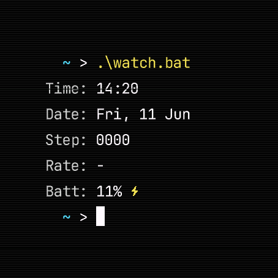

# TerminalWatchface

A retro terminal-style watchface for the **Garmin Fenix 8 47mm AMOLED**. All data is rendered as monospaced label/value pairs in a command-line aesthetic — complete with a blinking cursor, optional CRT scanlines, and inline sensor history graphs.



---

## Features

- Monospace terminal layout with shell prompt and blinking cursor
- **5 data rows** — time and date are always shown; lines 3–5 are fully configurable
- Each configurable line has **3 rotation slots** that cycle automatically on a set interval
- **Inline sensor graphs** — line, bar, or dual-overlay charts with configurable timeframe and color
- **34 data fields** across activity, health, and weather categories
- Battery footer with bolt icon while charging, percentage, and estimated days remaining
- Notification count badge in the header
- CRT scanline overlay (4 intensity levels)
- **4 font families** in 3 sizes each
- **20 colors** for independent label and value styling per slot
- Show seconds toggle and optional year in date
- Metric and imperial unit support

---

## Layout

```
           [2]                       ← notification count (hidden when 0)

~ > .\watch.bat

Time  : 14:32
Date  : Thu, 12 Jun

Heart : 72 bpm                       ← line 3 (rotates between up to 3 fields)
Steps : 007823 [GOAL]                ← line 4
Temp  : 18.5°C [↓12] [↑24]          ← line 5

~ > _                                ← blinking cursor

          ⚡ 74% [6d]               ← battery footer
```

---

## Settings

### Appearance

| Setting    | Options                                               |
|------------|-------------------------------------------------------|
| Font       | JetBrains Mono, Space Mono, Fira Code Mono, NB Architekt |
| Font Size  | Small, Medium, Large                                  |
| Scanlines  | Off, Subtle, Medium, Strong                           |

### Display

| Setting        | Options                                                                    |
|----------------|----------------------------------------------------------------------------|
| Show Seconds   | On / Off                                                                   |
| Show Year      | On / Off — appends year to compatible date formats                         |
| Date Format    | Day Month *(Mon, 12 Jan)*, ISO *(2025-06-12)*, DD-MM-YYYY, MM-DD-YYYY, Day+Num *(Thu 12)*, D Mon *(12 Jan)* |
| Rotate Every   | 3s, 5s, 10s, 15s, 30s, 1 min                                              |

### Color (Lines 1–2)

Label and value color can be set independently for the Time and Date rows.

### Lines 3–5 (Configurable)

Each line has three rotation slots — **Primary**, **R2**, and **R3**. The active slot cycles on the rotate interval; slots set to *None* are skipped. Each slot has its own field, label color, and value color.

---

## Data Fields

### Activity & Health

| Field                | Label       | Example         |
|----------------------|-------------|-----------------|
| Steps                | `Steps`     | `007823 [GOAL]` |
| Heart Rate           | `Heart`     | `72 bpm`        |
| Avg Heart Rate       | `Avg HR`    | `68 bpm`        |
| Max Heart Rate       | `Max HR`    | `185 bpm`       |
| Calories             | `Calories`  | `1840 kcal`     |
| Active Calories      | `Act Cals`  | `620 kcal`      |
| Distance             | `Distance`  | `4.32km`        |
| Altitude             | `Altitude`  | `124m`          |
| Elevation (sensor)   | `Elevation` | `126m`          |
| Floors               | `Floors`    | `↑8  ↓3`        |
| Intensity Mins (wk)  | `Int Mins`  | `142`           |
| Active Mins (day)    | `Act Mins`  | `38`            |
| Move Bar             | `Move Bar`  | `2/5`           |
| Body Battery         | `Body Bat`  | `74%`           |
| Stress               | `Stress`    | `32`            |
| Blood Oxygen (SpO2)  | `SpO2`      | `97%`           |
| Respiration Rate     | `Resp Rate` | `14/m`          |
| Recovery Time        | `Recovery`  | `18h`           |
| Wrist Temperature    | `Wrist Temp`| `36.5C`         |
| Barometric Pressure  | `Pressure`  | `1013.2hPa`     |

### Weather

| Field                   | Label    | Example                    |
|-------------------------|----------|----------------------------|
| Temperature             | `Temp`   | `18.5°C`                   |
| Feels Like              | `Feels Like` | `16.2°C`               |
| Temperature + Condition | `Temp`   | `18.5°C [CLEAR]`           |
| Temperature + Min/Max   | `Temp`   | `18.5°C [↓12] [↑24]`      |
| Temperature + Wind      | `Temp`   | `18.5°C 14km/h NW`         |
| Condition               | `Weather`| `[PCLOUD]`                 |
| Condition + Precip      | `Weather`| `[RAIN] 60%`               |
| Precipitation           | `Precip` | `20%`                      |
| Wind                    | `Wind`   | `14km/h NW`                |
| UV Index                | `UV Index`| `3`                       |
| Hourly Forecast (graph) | `Forecast`| *(temperature chart)*      |

---

## Graphs

Certain fields can be displayed as **inline sensor history charts** instead of a single value. When a graph view is active, a mini chart is drawn to the right of the label for the configured timeframe.

### Graph-capable fields

| Field            | View Modes                                          |
|------------------|-----------------------------------------------------|
| Heart Rate       | Value, Line Graph, Graph + Value, Bar Graph, Dual Graph |
| Body Battery     | Value, Line Graph, Graph + Value, Bar Graph, Dual Graph |
| Stress           | Value, Line Graph, Graph + Value, Bar Graph, Dual Graph |
| Blood Oxygen     | Value, Line Graph, Graph + Value, Bar Graph, Dual Graph |
| Wrist Temp       | Value, Line Graph, Graph + Value, Bar Graph, Dual Graph |
| Elevation        | Value, Line Graph, Graph + Value, Bar Graph, Dual Graph |
| Pressure         | Value, Line Graph, Graph + Value, Bar Graph, Dual Graph |
| Weather Forecast | Line Graph, Graph + Value, Bar Graph                |

### Graph settings (per field)

| Setting          | Options                                      |
|------------------|----------------------------------------------|
| View Mode        | Value, Line Graph, Graph + Value, Bar Graph, Dual Graph |
| Time Frame       | 15m, 30m, 1h, 2h, 4h, 8h, 24h              |
| Line Color       | Any of the 20 available colors               |

**Dual Graph** overlays two sensor history lines on a shared axis. A secondary field and color can be configured independently, with min/max labels on both sides.

**Weather Forecast** pulls up to 24 hours of hourly temperature data and renders it as a line or bar graph with configurable timeframe (e.g. `+6h`).

---

## Battery Footer

| State          | Display                  |
|----------------|--------------------------|
| Normal         | `74% [6d]`               |
| Charging       | `⚡ 74% [6d]`            |
| Low (≤ 10%)    | `8%` in red              |
| Full (100%)    | `100%` in green          |

Days remaining is shown when the device can estimate it. The bolt icon is always shown while charging.

---

## Colors

20 colors are available for independent label and value styling on each rotation slot:

| #  | Name        | #  | Name        |
|----|-------------|----|-------------|
| 0  | White       | 10 | Lime        |
| 1  | Green       | 11 | Teal        |
| 2  | Cyan        | 12 | Purple      |
| 3  | Yellow      | 13 | Dark Grey   |
| 4  | Orange      | 14 | Sky Blue    |
| 5  | Red         | 15 | Amber       |
| 6  | Blue        | 16 | Emerald     |
| 7  | Magenta     | 17 | Turquoise   |
| 8  | Light Grey  | 18 | Coral       |
| 9  | Pink        | 19 | Violet      |

---

## Device

- **Garmin Fenix 8 47mm AMOLED**
- Connect IQ API level 6.0.0+
- Built with Connect IQ SDK 9.2.0
